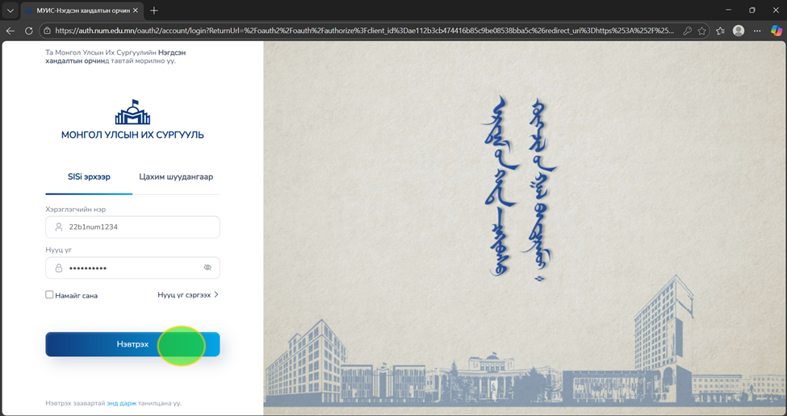
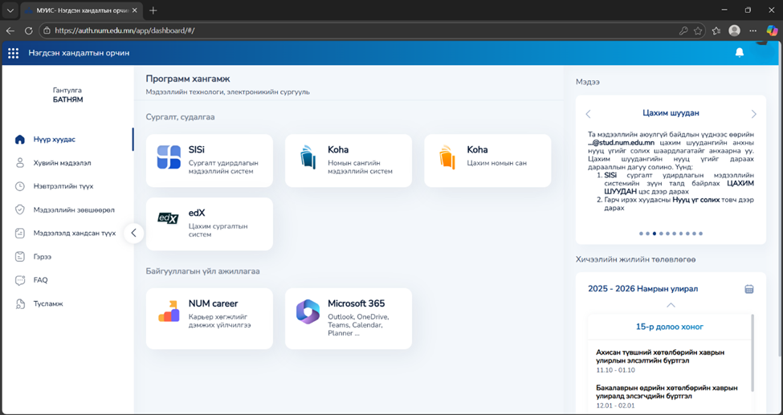
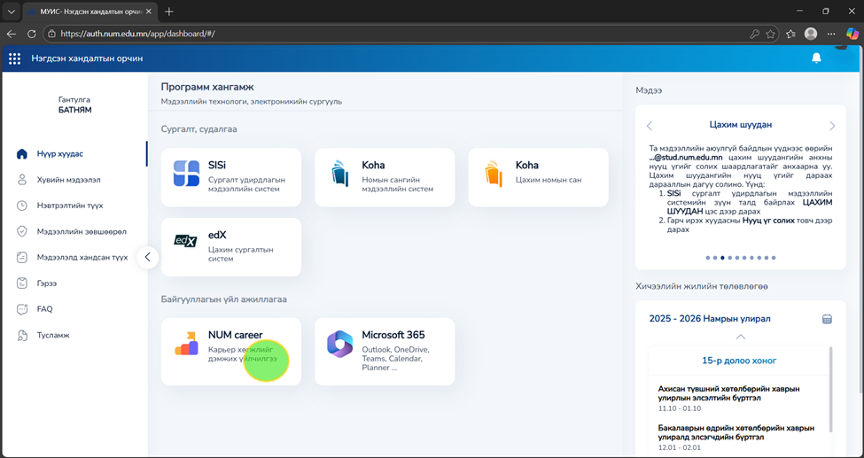
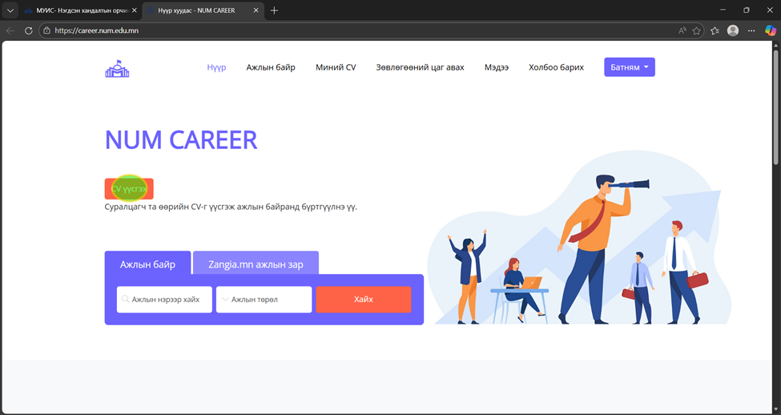
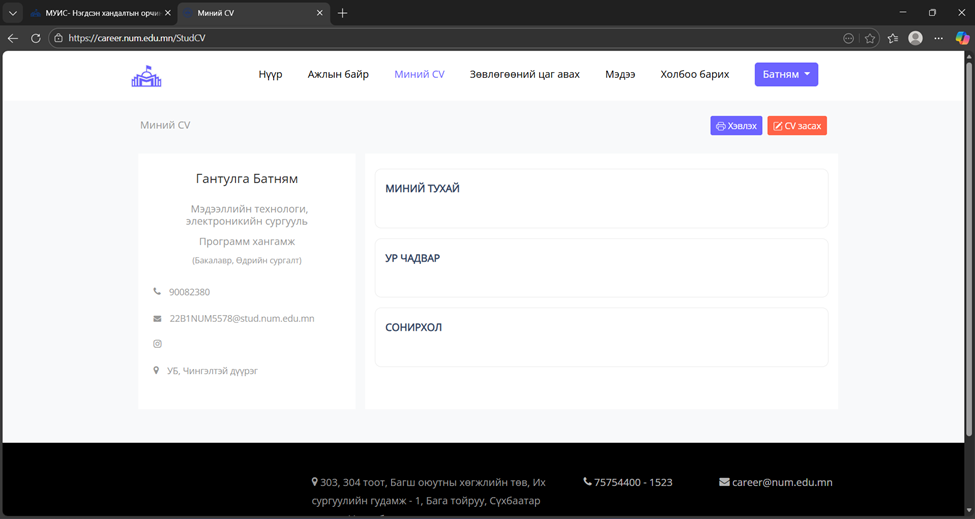
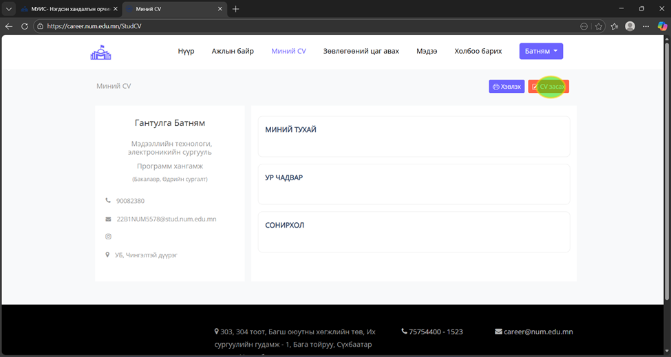
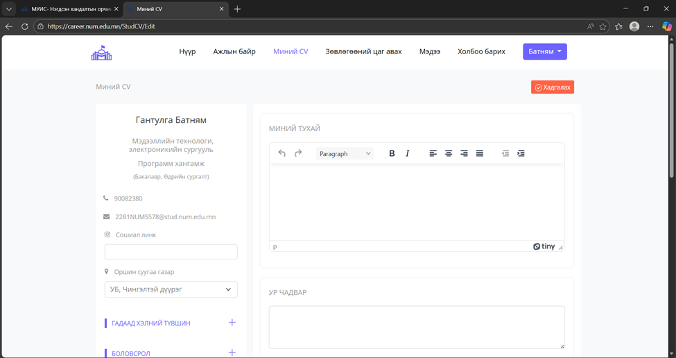
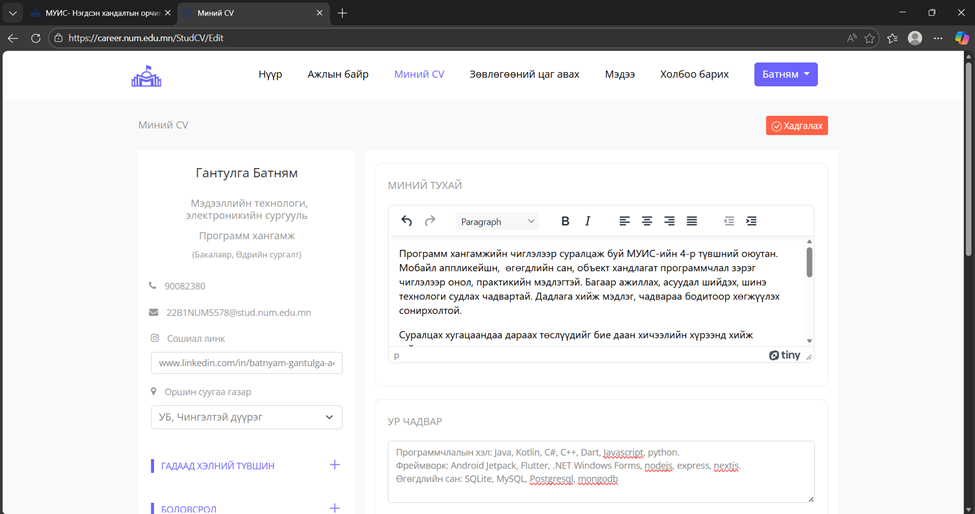
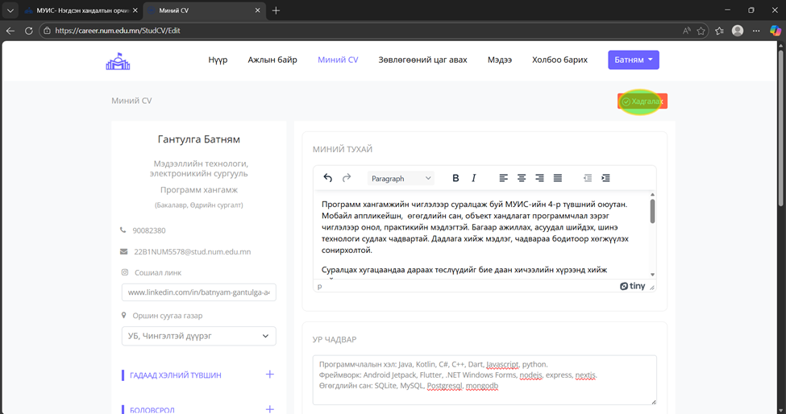

# Процедур: NUM Career системд CV анх удаа үүсгэх

---

## 1. Зорилго

Энэхүү процедур нь **NUM Career** систем дотор оюутан өөрийн **CV (Curriculum Vitae)**-г анх удаа үүсгэх үйл явцыг зааварлана.

CV нь карьер хөгжлийн дараах үйлчилгээнд ашиглагдана:

- ажилд орох
- дадлага хийх
- тэтгэлэг, хөтөлбөрт материал илгээх

Иймд хэрэглэгч **зөв, бүрэн мэдээлэлтэй CV** үүсгэх нь маш чухал.

---

## 2. Өмнөх нөхцөлүүд

Процедурыг эхлэхийн өмнө дараах нөхцөлүүд биелсэн байх ёстой:

- Та **Нэгдсэн хандалтын орчинд** NUM-ийн албан хэрэглэгчийн эрхээр нэвтэрсэн байх
- **NUM Career** системд хандах эрхтэй байх
- Хувийн мэдээлэл (нэр, имэйл, курс/хөтөлбөр) **SISI** дээр зөв бөглөгдсөн байх
- Интернэт холболт тогтвортой байх

---

## 3. Алхамууд

### 3.1 Алхам 1 – Нэгдсэн хандалтын орчинд нэвтрэх

**Үйлдэл:**  
`https://auth.num.edu.mn/` сайтаар дамжин өөрийн хэрэглэгчийн нэр, нууц үгээ оруулан **Нэвтрэх** товчийг дарна.

**Оролт:**  
- SISI нэвтрэх нэр  
- Нууц үг

**Гаралт:**  
- Нэгдсэн хандалтын орчны **Dashboard** дэлгэц нээгдэнэ

---

### 3.2 Алхам 2 – “Байгууллагын үйл ажиллагаа” хэсгээс NUM Career сонгох

**Үйлдэл:**  
Нүүр хуудсан дээрх модулиудаас **“Байгууллагын үйл ажиллагаа”** хэсгийн **NUM Career** картыг дарна.

**Гаралт:**  
- NUM Career карт харагдана

---

### 3.3 Алхам 3 – “NUM Career – Карьер хөгжлийг дэмжих үйлчилгээ” карт дээр дарах

**Үйлдэл:**  
NUM Career картыг дарна.

**Гаралт:**  
- Систем автоматаар `https://career.num.edu.mn` хаяг руу шилжинэ

---

### 3.4 Алхам 4 – “CV үүсгэх” товчлуур дээр дарах

**Үйлдэл:**  
**“CV үүсгэх”** товчлуурыг дарна.

**Гаралт:**  
- **“Миний CV”** хэсэг рүү шилжинэ

---

### 3.5 Алхам 5 – “CV засах” товчлуур дээр дарах

**Үйлдэл:**  
**“CV засах”** товчлуур дээр дарна.

**Гаралт:**  
- Мэдээлэл оруулах боломжтой дэд хэсгүүд нээгдэнэ

---

### 3.6 Алхам 6 – Өөрийн мэдээллүүдийг оруулах

**Үйлдэл:**  
Өөрийн мэдээллүүдийг харгалзах талбаруудад оруулна.

**Оролт:**  
- Сошиал линк  
- Танилцуулга  
- Ур чадвар  
- Сонирхол  
- Хэлний түвшин  
- Бусад холбогдох мэдээлэл

**Гаралт:**  
- Мэдээлэл амжилттай бөглөгдсөн талбарууд харагдана

---

### Notes

- Хэрэв зураг оруулах бол **JPG** эсвэл **PNG** формат зөвшөөрөгдөнө.

### Warnings

- ⚠ Хувийн мэдээлэл буруу бөглөвөл ажил олгогчид буруу дамжиж магадгүй — хадгалахаасаа өмнө сайтар шалгана уу.

---

### 3.7 Алхам 7 – CV-г хадгалах

**Үйлдэл:**  
**“Хадгалах”** товчлуурыг дарна.

**Гаралт:**  
- CV амжилттай үүсэж хадгалагдана

### note

- CV-г хадгалсны дараа та хүссэн үедээ дахин засвар хийх боломжтой.

### warning

- ⚠ Системээс гарвал хадгалалт хийгдэхгүй тул **“Хадгалах (Save)”** товчлуурыг заавал дарна уу.
---

## 4. Хүлээгдэж буй үр дүн

Процедур амжилттай дууссаны дараа:

- **“Миний CV”** хэсэгт таны CV харагдана
- Та CV-г:
    - файл хэлбэрээр татаж авах
    - засах
    - дахин шинэчлэх боломжтой болно

---

## 5. Анхааруулга ба тайлбар

!!! note "Тайлбар (Notes)"
    
    CV-г хадгалсны дараа та хүссэн үедээ дахин засвар хийх боломжтой.  
    Зураг оруулахдаа **JPG** эсвэл **PNG** формат ашиглана уу.

!!! warning "Анхааруулга (Warnings)"
    
    Хувийн мэдээлэл буруу бөглөвөл ажил олгогчид буруу дамжиж болзошгүй тул  
    хадгалахаасаа өмнө сайтар шалгана уу.
    Системээс гарвал хадгалалт хийгдэхгүй тул  
    **“Хадгалах (Save)”** товчлуурыг заавал дарна уу.
